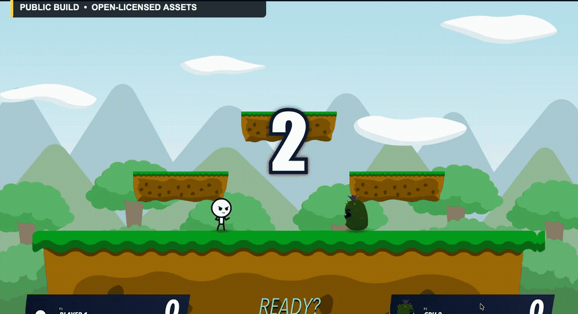

# Super Bash Folds

<p align="center">
  <strong>An open-source platform fighter where fighters and stages are portable content packs.</strong>
</p>

<p align="center">
  <a href="https://super-bash-folds.spry-crumb-3668.chatgpt.site/play/index.html"><strong>Play in your browser</strong></a>
  ·
  <a href="https://github.com/Swarek/Super_Bash_Folds/issues?q=is%3Aissue+state%3Aopen+label%3A%22good+first+issue%22"><strong>Good first issues</strong></a>
  ·
  <a href="https://github.com/Swarek/Super_Bash_Folds/discussions"><strong>Join the community</strong></a>
</p>

<p align="center">
  <a href="https://github.com/Swarek/Super_Bash_Folds/actions/workflows/ci.yml"></a>
  <a href="LICENSE"></a>
  <a href="https://github.com/Swarek/Super_Bash_Folds/milestone/1"></a>
  <a href="https://github.com/Swarek/Super_Bash_Folds/stargazers"></a>
</p>



Super Bash Folds is a fast local platform fighter for the web. The engine
supports keyboard and controllers, configurable controls, CPU opponents,
shields, rolls, air dodges, grabs, throws, ledges, projectiles, items, stock
matches, timed matches, and sudden death.

Its defining feature is the content system: a fighter or stage lives in one
folder, is validated by the project tools, and joins the game without a manual
engine registry edit.

> [!IMPORTANT]
> The playable build and this repository contain only original or
> redistributable content. Third-party franchise assets shown in early private
> development footage are not included, supported, or required.

## Project status

The current public preview is a playable foundation, not a finished competitive
game. It includes:

- 14 open-licensed fighter prototypes;
- one CC0 stage;
- 20 original items and a redistributable audio library;
- local multiplayer, CPU play, configurable controls, and controller support;
- fighter and stage pack generators, validators, and an Animation Lab;
- automated public-content, history, test, build, and performance checks.

The highest-priority goal is a flagship original fighter with a complete,
purpose-built animation set. Artists, animators, game designers, developers,
and playtesters are all welcome.

## Project origin

The initial game engine, content-pack tooling, public website, documentation,
generated interface art, and launch video edit were produced with
**GPT-5.6-Sol**, directed, tested, and reviewed by Swarek. The project is now an
open foundation: new community work is credited through Git history and asset
provenance records.

## Play or run locally

Play the hosted build at
[super-bash-folds.spry-crumb-3668.chatgpt.site/play](https://super-bash-folds.spry-crumb-3668.chatgpt.site/play/index.html).

To run the project locally, install Node.js 20 or newer:

```sh
git clone https://github.com/Swarek/Super_Bash_Folds.git
cd Super_Bash_Folds
npm ci
npm run dev
```

Vite prints the local address, which defaults to
[`http://localhost:4173/`](http://localhost:4173/).

## Choose a contribution

| If you enjoy… | A useful first contribution |
| --- | --- |
| Character art or animation | Help design and animate the first flagship original fighter |
| Game design | Review a move set, hitboxes, knockback, and competitive counterplay |
| TypeScript | Improve pack tooling, engine mechanics, accessibility, or tests |
| Level art | Create a redistributable stage pack |
| Playing platform fighters | Test controllers, movement, match rules, and report reproducible issues |
| Documentation | Turn one pack workflow into a smaller, clearer tutorial |

Start with the [contribution guide](CONTRIBUTING.md), browse
[`good first issue`](https://github.com/Swarek/Super_Bash_Folds/issues?q=is%3Aissue+state%3Aopen+label%3A%22good+first+issue%22),
or propose an idea in
[GitHub Discussions](https://github.com/Swarek/Super_Bash_Folds/discussions).
The current direction is tracked in [ROADMAP.md](ROADMAP.md).

## Add a fighter

```sh
npm run fighter:new -- my-fighter --kind 2d
# complete fighters/my-fighter/fighter.json and render.json
npm run fighter:build -- my-fighter
npm run fighter:check
```

The pack directory is the source of truth. The project generates registries,
render manifests, portraits, and atlases from it. The 50-animation contract,
licensing rules, and troubleshooting steps are documented in
[`fighters/README.md`](fighters/README.md).

## Add a stage

```sh
npm run stage:new -- my-stage --kind 2d
# complete stages/my-stage/stage.json, PROVENANCE.md, and assets/
npm run stage:build
npm run stage:check
```

A stage pack owns its collisions, ledges, spawn points, blast zone, rendering,
and license metadata. See [`stages/README.md`](stages/README.md).

## Verify a contribution

Install the tools reported by `npm run content:doctor`, then run the check
closest to your change while iterating. Before opening a pull request, run:

```sh
npm run validate:public
```

This command validates packs and asset policy, runs the public test suite,
checks Git history, builds the game, and verifies the distributable output and
performance budgets.

## Licenses and provenance

- Code: [MIT](LICENSE).
- Original project assets under `public/assets/open/`: CC0-1.0.
- Third-party assets: [credits, licenses, and source links](THIRD_PARTY_ASSETS.md).
- Asset contributions: [asset policy](ASSET_POLICY.md).
- Naming and content boundaries: [IP and content policy](IP_AND_CONTENT_POLICY.md).

Every distributed asset must have a verifiable source and compatible license.
Generated files must not be edited directly.

## Community

Please read the [Code of Conduct](CODE_OF_CONDUCT.md). Use
[Discussions](https://github.com/Swarek/Super_Bash_Folds/discussions) for ideas
and design questions, and [Issues](https://github.com/Swarek/Super_Bash_Folds/issues)
for reproducible bugs or accepted work.
